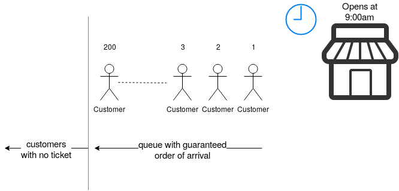

# ticket-system-kata

Practicing the temporal order of a ticket system.

## Domain

We are working in a famous old museum, which attracts a lot of tourists each day. The demand is high and few space available compared.

### Problem Space

The stakeholders want to create a ticket system that matches the current way the museum has to sell tickets as a value proposition, in order to attend you can only buy a ticket the same day. Instead of selling the tickets upfront, we want to sell the tickets for the same day starting at 9:00 local time online.

Since the demand is high and the space available reduced, the stakeholders asked to emulate how selling the ticket happens in the real world with the online shop, with a virtual queue which guarantees the order of arrival.

